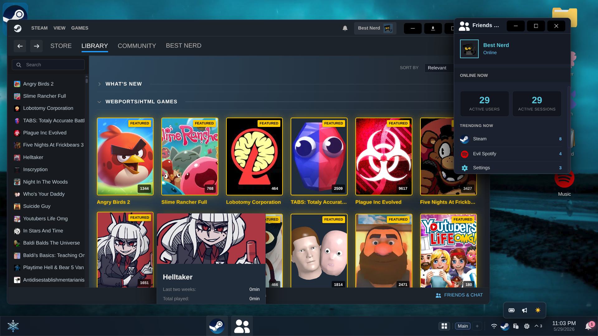
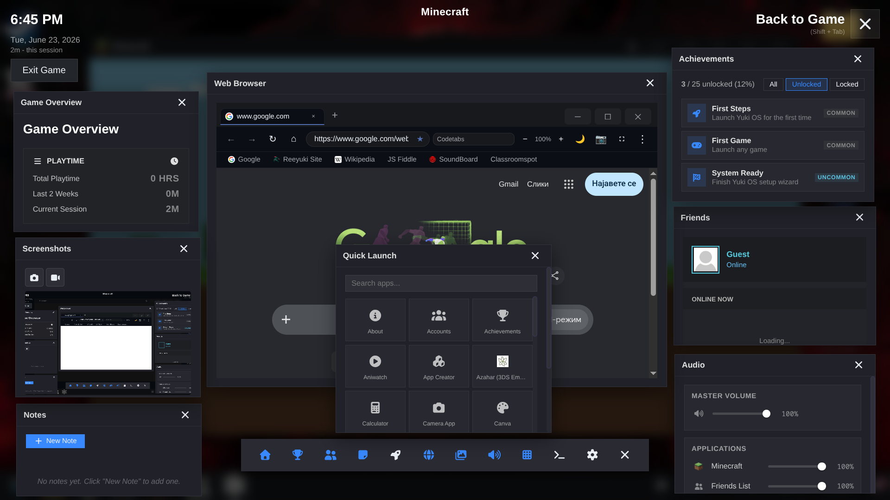
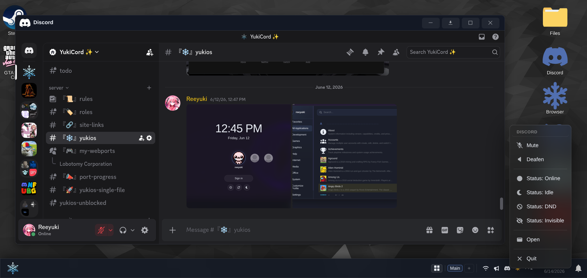
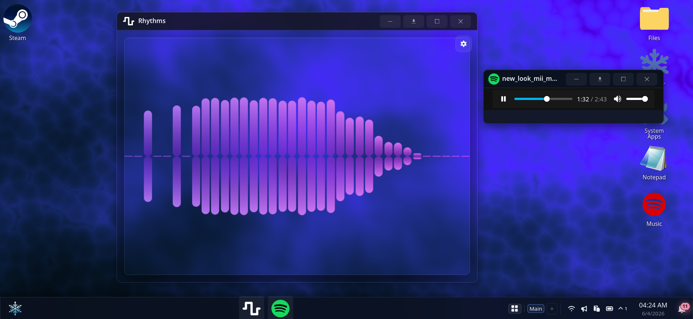
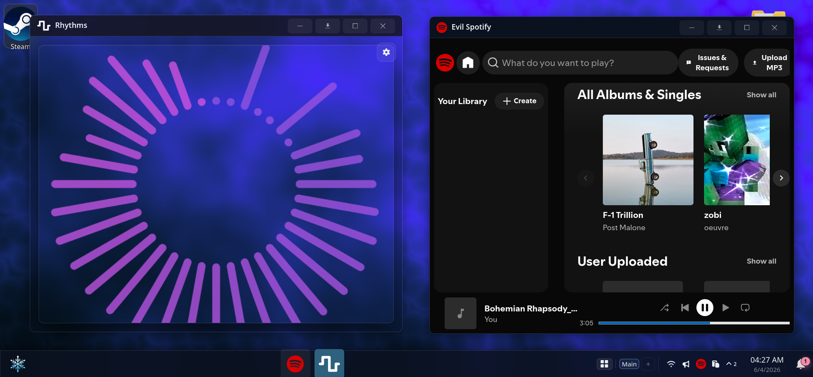
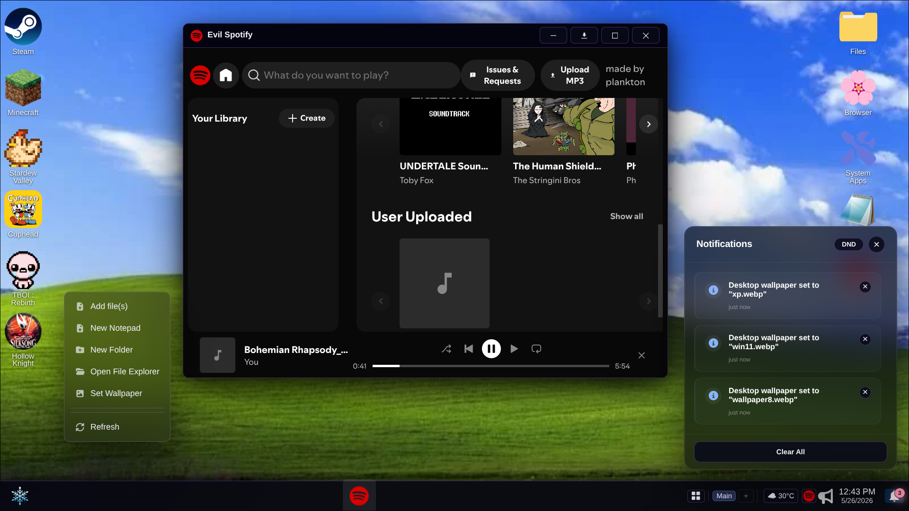
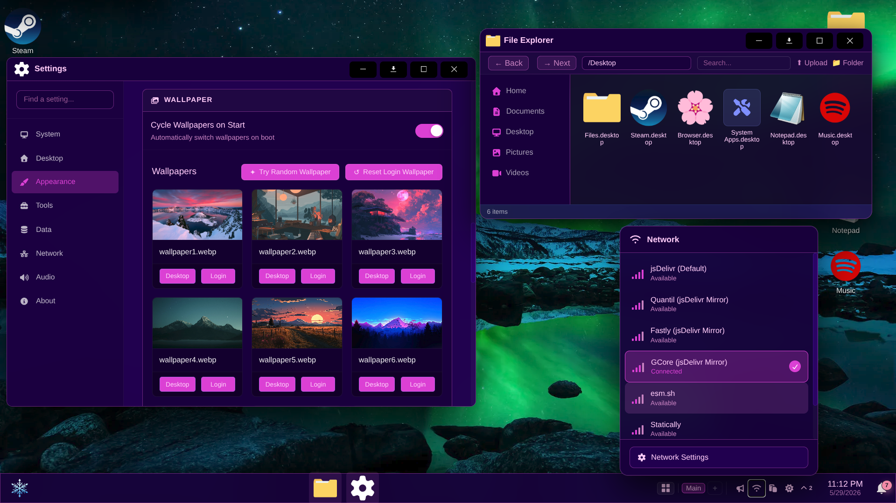

# YukiOS - Browser Desktop Environment

<div align="center">

[](https://github.com/Reeyuki/yukios)
[](LICENSE)
[](https://discord.gg/wufbWFwr4G)

**Try it now:** [yukios.pages.dev](https://yukios.pages.dev) · [yukios.vercel.app](https://yukios.vercel.app) ·
[yukios.netlify.app](https://yukios.netlify.app) · [yukiwebos.github.io](https://yukiwebos.github.io)

</div>

> A browser-based desktop environment running in a single web page, combining windowed multitasking, persistent storage,
> emulators, tools, and a large collection of applications and games.

YukiOS turns a browser tab into a working desktop-style space with draggable windows, multitasking, file handling,
emulators, productivity tools, and interactive apps. Everything runs locally in the browser with persistent storage and
session state.

It supports running Flash content, DOS programs, console emulation, WebAssembly apps, and standard web applications side
by side.

Its built entirely in vanilla javascript/typescript without any frameworks.

  
  
  
  
[Workspaces](.github/Workspaces.png)

# ✨ Desktop Experience

- Draggable, resizable, minimizable, maximizable windows
- Window snapping (half screen, quarter screen, fullscreen)
- Multiple workspaces with independent layouts
- Window switching and focus cycling (with alt+Q)
- Window context menus (snap, move, pin, workspace transfer)
- Window header context menus
- Window icons in title bar
- Taskbar positioned on any edge of the screen
- Taskbar drag to reorder and click to minimize/restore
- Live taskbar window preview on hover with close button
- System tray with background-running apps
- Tray icon scroll actions for audio, brightness, and workspace switching
- Tray context menus with per-item quick actions
- Desktop icon system with persistent shortcuts and image thumbnails
- Desktop drag-and-drop from host OS and icon rearrangement
- Desktop stretch scroll prevention toggle
- Alt+Left-Click window drag / Alt+Right-Click window resize
- Window animation system with 35+ effects
- Cursor launch effect on app start like in kde plasma
- Automatically saves and restores open apps, window positions and sizes, workspace assignments, scroll positions,
  window states (minimized, fullscreen, snapped), focus order

# 🧭 Navigation & UI

- Start menu with keyboard navigation, alphabetical grouping, shortcuts for launch(Space, Tab, Ctrl), and a Recent page
  showing last-opened apps and files with clear button
- Notification center with grouped messages
- Do Not Disturb mode
- Notification positioning controls
- Desktop and file context menus: New Folder / Text Document, Add file(s) from OS, Download, Add to archive, Extract
  here, Set as wallpaper, Open Terminal Here, Screen Capture, Copy/Cut/Paste, Rename, Properties, Convert/Transform,
  Refresh, Background submenu (Vanta.js presets / video wallpapers) with keyboard navigation (arrow keys, Enter, Escape,
  submenu traversal)
- Command palette (Ctrl+K/P/F1) for app, file, and command search with built-in calculator, terminal run support with >
  prefix, and unit converter
- Clippy contextual assistant with per-app tips
- Animated UI with adaptive transparency effects: start menu, wallpaper switch, audio mixer, context menu, and
  notification sliding animations
- Keyboard shortcuts app for customizing global hotkeys

**Key Global Shortcuts:**

- Ctrl+K / Ctrl+P / F1 - Open command palette
- Ctrl+D - Show/hide desktop
- Alt+Q - Cycle through windows
- Ctrl+Shift+S - Full screenshot
- Ctrl+Alt+S - Area screenshot
- Ctrl+Shift+R - Screen recording

**Command Palette Features:**

- Search apps, files, and system commands
- Quick actions: wallpaper, themes, DND, mute, workspace switching, logout & more
- Terminal commands (prefix with `>`)
- Built-in calculator and unit converter
- Screenshot and screen recording controls

# 📁 Files & Storage

- Persistent browser storage using IndexedDB
- File explorer with thumbnails and previews with file/folder upload support
- Drag-and-drop file operations from host OS
- File properties dialog with rename support
- Drag-select multiple files with selection box
- Trash bin with restore functionality
- File information tooltip on desktop/explorer
- Storage indicator showing total used space in Explorer sidebar
- Archive support: `.zip`, `.gz`, `.tar`, `.tar.gz`, `.tgz`, `.tar.xz`, `.7z`, `.bz2`, `.tar.bz2`, `.xz`, `.rar`
  (create: `.zip`, `.7z`, `.tar`, `.tar.gz`, `.tar.bz2`, `.gz`, `.bz2` with password-protected ZIP support)
- HTML file rendering support
- Dynamic favicon updates based on current app

# ⚙️ System Features

- Notification system with app icons and actions
- Audio mixer with per-app volume sliders, live waveform intensity visualizer, master/system volume, mute toggle, and
  tray icon with scroll-to-adjust - uses `AudioContext` gain nodes and patched iframe `AudioContext` for cross-origin
  audio control
- System sounds with interaction noises for common actions
- Achievement tracking and usage milestones
- Theme system with 40 presets and custom theme support, light/dark and transparency modes, with font options
  (Monocraft, Inter, Rubik, Sora, JetBrains Mono)
- Wallpaper customization with animated wallpaper and Vanta.js support
- PWA install and offline caching support
- User accounts with multi-profile support
- Lock screen, session management, and idle timeout
- Power management modes (Turbo, Balanced, Quality) with dedicated tray app and brightness controls (contrast, gamma,
  night mode)
- Custom cursor support (with miku by default)
- Import/export system for backup and migration
- Transparent UI toggle
- Clock system using OffscreenCanvas rendering and lightweight NTP offset sync with js worker
- Calendar popup from taskbar clock with monthly grid, keyboard navigation, and today button
- Events ("Plans") system with title, date/time, repeat (daily/weekly/monthly/yearly), reminders, notes, and color
  coding
- Agenda view showing today's plans and upcoming events, plus next alarm info

# 📦 Built-in Applications

80+ built-in applications and direct launch via URL parameters (`?app=` and `?game=`)

## 🧠 Productivity & Development

- Explorer
- Terminal (Unix-like commands with tab completion, history, pipelines, and glob patterns)
- Notepad
- Markdown Editor
- Yuki Code
- VS Code
- Settings
- Task Manager
- Installed Apps
- Calculator
- Clock (alarms, stopwatch, timer)
- About
- Shortcuts
- Setup Wizard
- What's New
- Achievements
- Profile Customizer
- Yuki AI Assistant
- Storage Editor
- Yuki Convert
- Clipboard Manager
- Categories
- Emoji Selector
- YukiDevTools (IT - TOOLS)
- Dev Tools (Eruda)
- Weather
- News
- YukiOS Guide
- Display Performance
- Network Tray
- Maps
- Virtual Machine Manager
- Accounts

## 🎨 Media & Creative Tools

- Paint
- Mini Paint
- Photopea
- LibreSprite
- Pixlr
- Camera App
- Media Viewer
- Office Viewer
- Evil Spotify
- Yuki Blender
- YouTube Utilities
- Rhythms (Cavalier-like audio visualizer)
- Screenshot (page capture, area selection, screen recording)
- Color Picker (screen color sampling with magnified preview)

## 🌐 Browser & Internet

- Yuki Browser
- WebTorrent Client
- Tor Connection Manager - anonymous browsing through the Tor network via WASM-based Tor client with Snowflake transport
- VNC Client (remote desktop via VNC with saved profiles and clipboard sync)
- Steam-like game launcher

## Web Apps

- Discord
- Spotify
- TikTok
- ChatGPT
- Grok
- Email providers (Gmail, Outlook, ProtonMail)
- DeepSeek
- Twitter/X
- Instagram
- Pinterest
- GitHub GitLab CodePen Replit
- Twitch
- SoundCloud
- Notion
- Figma
- Canva
- Google Docs
- kiwiIRC
- GeForce Now
- Scramjet Browser

## 🎮 Games & Emulation

- Yuki Emulator (EmulatorJS)
- Ruffle (Flash)
- JsDos (DOS)
- Virtual 86 (x86)
- Azahar (3DS Emulator)
- Flashpoint Database
- Steam app

### Steam-like In-Game Overlay

Shift+Tab overlay with draggable, resizable panels for any running game:

- Playtime overview (total, 2-week, and current session)
- Achievement browser with All/Unlocked/Locked filters
- Friends panel with live active user stats and persistent per-game sticky notes
- In-overlay web browser and Scramjet proxy panel
- Screenshot capture, gallery view, and video recording
- Performance monitor for fps/frame
- Overlay settings (toggle, perf monitor, rebindable shortcut key)

# 🔌 Extensibility

Custom App Creator for adding web shortcuts with auto-detected favicons and per-app CORS proxy.

# 🛠 Build & Deployment

```bash
pnpm run dev
pnpm run build:dev
pnpm run build
pnpm run preview
```

# 🤝 Contributing

See the [Development Guide](DEVELOPMENT.md).

# 🛠 Tech Stack

## Libraries

- [BrowserFS](https://github.com/jvilk/BrowserFS)
- [interact.js](https://github.com/taye/interact.js)
- [Ruffle](https://github.com/ruffle-rs/ruffle)
- [EmulatorJS](https://github.com/EmulatorJS/EmulatorJS)
- [Monaco Editor](https://github.com/microsoft/monaco-editor)
- [three.js](https://github.com/mrdoob/three.js)
- [PDF.js](https://github.com/mozilla/pdf.js)
- [JSZip](https://github.com/Stuk/jszip)
- [fflate](https://github.com/101arrowz/fflate)
- [archive-wasm (Spacedrive)](https://github.com/spacedriveapp/archive-wasm)
- [7z-wasm (use-strict)](https://github.com/use-strict/7z-wasm)
- [Handsontable](https://github.com/handsontable/handsontable)
- [Mammoth.js](https://github.com/mwilliamson/mammoth.js)
- [Font Awesome](https://github.com/FortAwesome/Font-Awesome)
- [emoji-mart](https://github.com/missive/emoji-mart)
- [Vanta.js](https://github.com/tengbao/vanta)
- [WebTorrent](https://github.com/webtorrent/webtorrent)
- [Eruda](https://github.com/liriliri/eruda)
- Scramjet / BareMux / Epoxy Transport
- [webtor-rs](https://github.com/igor53627/webtor-rs) WASM Tor client (Arti + Snowflake)

## Build tooling

- Vite
- TypeScript
- ESLint
- Prettier
- [vite-plugin-singlefile](https://github.com/richardtallent/vite-plugin-singlefile)
